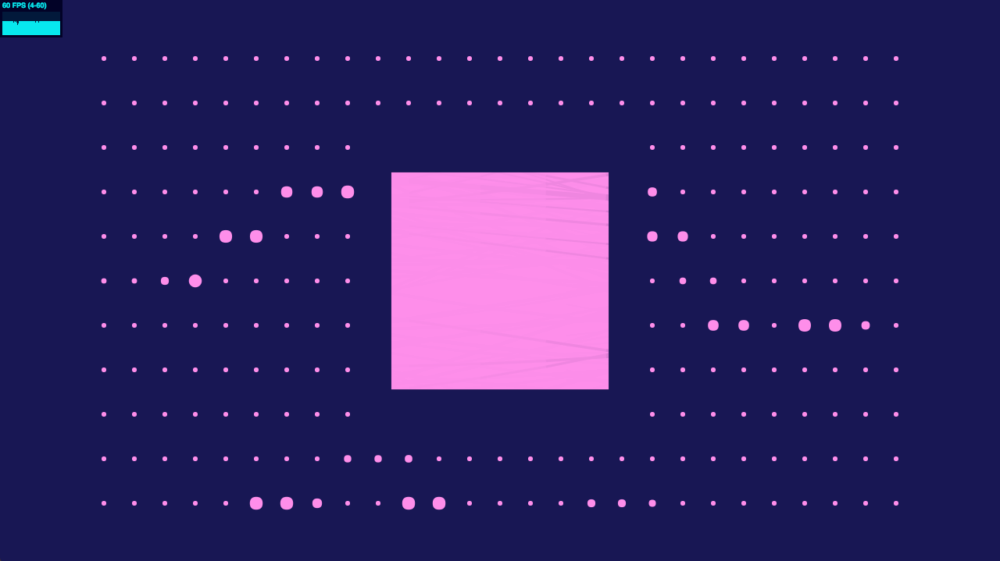

# Sound and colors (Audio Experiment)
> Workshop about canvas and Web Audio API 




## Installation

### Install Dependencies
```sh
npm install
```

### Run Server on localhost:8080
``` bash
npm run start
```

### Build your app
``` bash
npm run build
```

## Meta

Arnaud Pinot – [@PinotArnaud](https://twitter.com/PinotArnaud) – [https://github.com/arnvvd](https://github.com/arnvvd/)